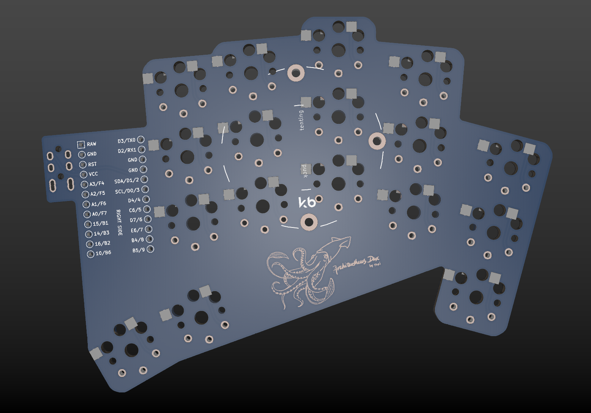

# Architeuthis dux mod



This is a modified version of [Architeuthis dux](https://github.com/tapioki/cephalopoda/tree/main/Architeuthis%20dux) with:

* Corrected edge cuts
* Replaced GND traces with filled zones
* Asymmetrical right PCB for symmetrical MCU placement

## Firmware

To preserve [@tapioki](https://github.com/tapioki)'s beautiful traces, microcontroller pins are asymmetrical on the right PCB. Use `a_dux` from QMK and add the following directives into `config.h`:

```c
#ifdef KEYBOARD_a_dux
#    undef DIRECT_PINS_RIGHT
#    define DIRECT_PINS_RIGHT { \
    { D3, B4, C6, F4, F7 }, \
    { D0, E6, D4, F5, B1 }, \
    { B5, D7, D2, F6, B3 }, \
    { B6, B2, NO_PIN, NO_PIN, NO_PIN } \
}
#endif
```

(PCBs are currently untested)
