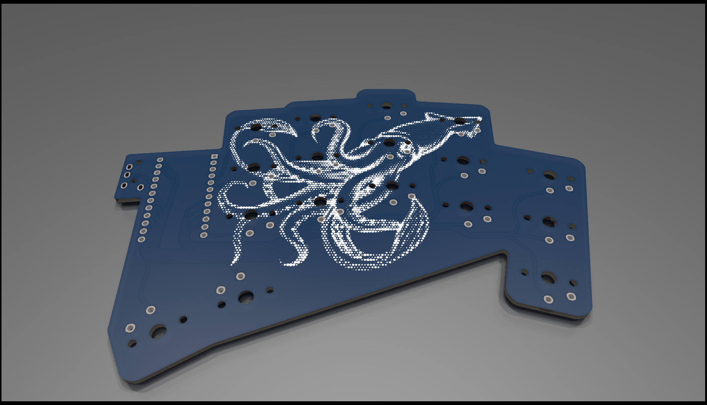

# イカ (Ika)



A simplified interation of [Architeuthis dux](https://github.com/tapioki/cephalopoda/tree/main/Architeuthis%20dux) with:

* Asymmetrical right PCB to support symmetrical MCU placement
* Soldered switches
* TRS compatible

Special thanks to [@GEIGEIGEIST](https://github.com/GEIGEIGEIST) for the halftone silkscreens.

## Supported Hardware

* ProMicro RP2040 controllers
* Kailh CPG1350 choc switches
* PJ320A audio jack

## Firmware

Use `a_dux` from QMK and add the following directives into `config.h`:
```c
#ifdef KEYBOARD_a_dux
#    undef DIRECT_PINS_RIGHT
#    define DIRECT_PINS_RIGHT { \
    { D3, B4, C6, F4, F7 }, \
    { D0, E6, D4, F5, B1 }, \
    { B5, D7, D2, F6, B3 }, \
    { B6, B2, NO_PIN, NO_PIN, NO_PIN } \
}
#endif
```
