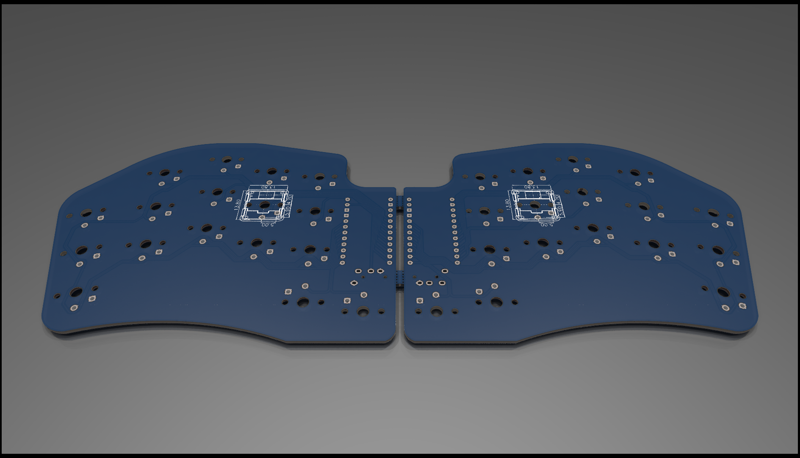

# Splinter

This is a post-modern take on David's [Paroxysm](https://github.com/davidphilipbarr/paroxysm) with:
* No power switches and reset buttons
* Bottom traces with no vias 
* TRS compatible

Use `cradio` firmware in QMK and ZMK.
 
